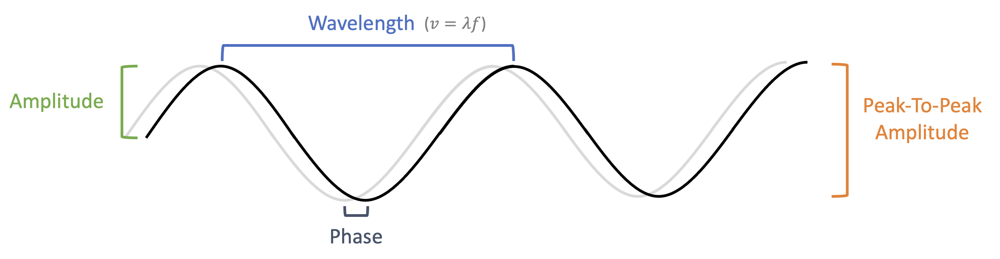

# Wireless Waves
While it is tempting to jump right into electromagnetic waves, we first need to explore a few fundamental concepts. This section will help us build a more general understanding of waves and some of their unique properties. To do this, we will consider different types of waves traveling over various mediums. If examples referencing sound seem like a significant detour, consider that your laptop uses radio waves (e.g., WIFI, Bluetooth), light waves (e.g., monitor, webcam), and sound waves (e.g., speakers, microphone) to *wirelessly* send and receive information.

## Defining Waves
I suspect most of us have a pretty good intuition of what makes a wave a wave. But before continuing, pause and try to define a wave with words.

Did you do it yet?

Seriously....give it a go.

Formal definitions are hard to build without using some mathematical tools. For example, the following can be used to help define one-dimensional waves:

 > ${\displaystyle {\frac {\partial ^{2}u}{\partial t^{2}}}=c^{2}{\frac {\partial ^{2}u}{\partial x^{2}}}}$ 

This may look intimidating, but don't let the fancy-pants symbols scare you away[^parth_g_wave_equation]. We won't dig into this during this tour, but we highly encourage you to spend some time playing with the math that describes waves.

For this workshop, we will use a less precise (but good enough for our purposes) definition:

> A wave is a disturbance that can travel without the transfer of matter

This is a simple definition, but there are still some key things to point out. First, note that the matter itself does not travel (it may move some, but it will return to where it started). The *disturbance*  is what travels. Imagine someone tying a long rope to a pole, grabbing the free end, pulling it tight, and then quickly moving the rope up and down. The rope itself doesn't 'travel', but the energy transferred into the rope will cause a disturbance that travels. While potentially less intuitive[^surfing], imagine a duck floating in a pond. If you make a wave, the water underneath the duck will move up and down, causing the duck to move up and down as well. However, the duck (and the water molecules underneath it) will not travel across the tub with the waves.

## A brief anatomy lesson
Before we start using waves to build things (yes, we consider wireless packets to be things, but feel free to disagree), it will help to first describe some characteristics of waves that we can measure and manipulate.

It is tempting to think of all waves as a simple, repeating sine wave like [$y = sin(x)$](https://www.desmos.com/calculator/0wqfaicrvy). However, the waves we will be working with are much more complex (although, later, we will find that any wave can be made by combining many different sine waves...but more on that in a bit). 

**Figure 1.1:** - Visualization of "You can't stop the signal" waveform created using [Sonic Visualiser](https://www.sonicvisualiser.org)

Although we will be working with more complicated wave forms, a simple sine wave is a good place to start. There are a few different ways we can graph a sine wave (and we will be looking at several of them). First, we can consider a 2d-graph of the wave plotted against space (think of a picture that shows the entire length of the rope tied to the pole).

**Figure 1.2:** - Properties of waves labeled on a simple sine wave

The **amplitude** of a wave measures the amount the medium is displaced. It can be measured from the starting point (equilibrium) to a the 'top' (aka. crest) *or* 'bottom' (aka. trough) of the wave (this is know as "peak amplitude"). It can also be measured as the distance between the top *and* bottom points (known as "peak-to-peak amplitude").

The **wavelength** (often written as the Greek lambda symbol: $\lambda$) measures the length of the wave per cycle (based on the name, I bet you didn't see that coming). The crest or trough are usually used as reference points to determine the cycle for simple waves.

We can make a graph of the same wave using time instead of space for one of the axes (imagine recording the displacement of a single point on the rope over time).The **period** is the amount of time it takes for one cycle to complete. It is usually recorded as "seconds per cycle". If you take the inverse of the wave period ($\frac{1}{\text{period}}$) you will get the wave **frequency** (often designated by the letter $f$). Frequency is usually recorded as "cycles per second" (aka. hertz or Hz).

Note that we have not yet talked about the speed the wave propagates ($v$). For this workshop, we will keep this value constant. While it may seem strange to try to keep this value constant, this is not uncommon in the real world. If you want the speed that rope waves travel down the rope to remain constant, keep the tension the same. If you want the speed that sound waves move through the air to remain constant, keep the temperature and pressure the same[^concert]. If you want the speed of light waves to remain constant, use a vacuum[^speed_of_light_in_air].

So, if the speed that the wave travels down our rope is constant, you need to shorten (slow down) the frequency to get longer waves. On the other hand, if you want to get a shorter waves, you need to increase (speed up) the frequency[^wave_energy]. This relationship describes the universal wave equation:

> $v = \lambda f$

Where $v$ is the speed of the wave, $f$ is the frequency of the wave, and $\lambda$ is the length of the wave.

There is one more thing we still should define: phase. Consider two different waves with the same $v$, $f$, and $\lambda$ values. If you start both waves at the exact same time, they will look in sync. Now start one wave at a slightly different time. Although they will have identical wavelengths and frequencies, the disturbances will both appear to be out of sync[^multiple_of_f].  **Phase** is a measurement of the offset caused by different 'start' times, and is often represented with the Greek symbol $\omega$ (omega).

Phase is normally lumped in with properties of single waves, but this can lead to confusion. Remember that phase is a comparison of two waves. Whenever you think about phase, remember to ask "compared to what?"

So far, we have been plotting waves in two-dimensions. In three dimensions, the direction the wave oscillates (from peak to trough) can change. This is called **polarization**.

**Figure 1.3:** Example of polarized light (image source: [Wikipedia](https://en.wikipedia.org/wiki/Polarizing_filter_(photography)#/media/File:Circular.Polarization.Circularly.Polarized.Light_Circular.Polarizer_Creating.Left.Handed.Helix.View.svg))

## Wave Superposition
If you want to try to sound smart, you can always try to throw around "wave superposition". It sounds complicated, but it just means that when waves pass through each other, they don't change. Although the waves don't change, each wave will additively contribute to the amount the medium is disturbed.

When the waves add together and cause the medium to be disturbed more, it is called "constructive interference". When the waves cause the medium to be disturbed less, it is called "destructive interference".

**Figure 1.4:** Constructive and destructive interference

In the next section, we will discuss how we can record waves (and we will consider some of interesting consequences of trying to do so). First, it is important to note that we can only measure the disturbances that various waves cause. There is no good way to measure the wave itself. When we consider this in the context of superposition, there are some interesting consequences.

As a thought experiment, Imagine creating two sine waves, each with a different frequency or phase (and optionally amplitude). Send them off in the same direction and from the same point. They will constructively and destructively interfere with each other for as long as they travel (similar to the pictured above).

If we try to measure these two simple sine waves, they will appear as one complex wave. Next, instead of two waves, consider hundreds of sine waves with different frequencies, phases, and amplitudes, all starting from the same point. The wave we measure will look very complex. In fact, with the right combination of sine waves, you can create any complex wave form.

**Figure 1.5:** Sine components of a square wave ([playground](https://www.desmos.com/calculator/iqawedewfv))

## Fourier Transform
We just discussed how to make a complex wave by adding many different sine waves together. The next question is, can we turn a complex wave back into its constituent sine waves. The answer is, with some level of certainty, yes. To do this, we can use an incredibly useful mathematical tool called the Fourier Transform.

Unfortunately, we do not have time to dive into the Fourier transform during this during this tour. However, we will be referencing one very useful application in some of the following sections, the 'waterfall' display. To make these displays, software uses a version of the Fourier Transform to try to determine the different frequencies that make up a complex signal. It plots the frequencies detected in a small amount of time (known as the window) on one axis. As time goes on, the software will slowly move old frequency plots (usually down) to make room for new frequency plots. The result is a plot of frequencies vs time.

**Figure 1.6:** Spectrogram showing Doppler shift of satellites

## Demos and Exercises

* **Demo:** Play with waves on a slinky and spring:
  * As one end of the spring moves up and  down, how many different peaks and troughs can you see? What causes this number to change?
  * Consider a transverse wave(compression) on a slinky. If you were to measure and plot the distance between any two rings over time, what would the result look like?
* **Demo:** View a waterfall diagram of live audio from a microphone. 
  * What happens when you clap?
  * What happens when you whistle?
  * What happens when two people whistle at different tones?
* **Demo:** Listen to a Shepard's tone ad try to think of how it might work. Look at the signal in a waterfall diagram.
* **Exercise:** Use GNU Radio to create a wave (Signal Source) and view the results in the time domain and on a waterfall diagram (QT GUI Sink)

**Figure 1.7:** Sample of GNU Radio output

## Additional Resources

   * Types of Waves:

        * [Old-school video showing different types of waves](https://www.youtube.com/watch?v=jUQkG1A0_Sk)
        * [Wave Properties and Characteristics](https://phys.libretexts.org/Courses/University_of_California_Davis/UCD%3A_Physics_7C_-_General_Physics/08._Waves/8.1%3A_Introduction_to_Waves/2._Wave_Properties_and_Characteristics) 

   * Fourier Transforms

        * [Fourier Transforms](https://www.jezzamon.com/fourier/)
        * [3B1B video series on Fourier Transform](https://www.youtube.com/watch?v=spUNpyF58BY)

        * [Fourier Transform Visualization](https://prajwalsouza.github.io/Experiments/Fourier-Transform-Visualization.html) 

[^parth_g_wave_equation]: https://www.youtube.com/watch?v=ub7lok-JQJE
[^surfing]: If you have ever gone surfing (or watched anyone else surf) you may point out that waves carry surfers towards the shore. I think this idea is one of the reasons the bobbing (but not traveling) rubber ducky example seem less intuitive. However, when surfing, note that the waves must 'break' before you can ride them. If you watch closely, you will often find several surfers bobbing up and down behind the breaking point, just waiting for a high-energy wave to ride.
[^concert]: Think of a time where you listened to loud music from really far away. If the frequency (pitch) changed the speed that sound travels, the different notes would all arrive out of sync.
[^wave_energy]: Note that it takes extra energy to increase the frequency (just think of moving that rope up and down faster and faster). This also means that waves with shorter wavelengths will have more energy. This is part of the reason why the radiation from your Bluetooth headphones, using a relatively long wavelength of 12.5 cm,  will not burn your ears. On the other hand, the ultraviolet light from the sun, with a shorter wavelength between 100-400nm, can easily give you sunburn.
[^speed_of_light_in_air]: The speed of light in a vacuum is 299,792,458 m/s, and the speed of light in air is around 299,705,000 m/s. As a comparison (which is fun to think about the next time you watch fireworks), sound travels at around 331 m/s in air
[^multiple_of_f]: At least, they will appear out of sync if you do not start the waves with a time difference that is a multiple of $f$.
