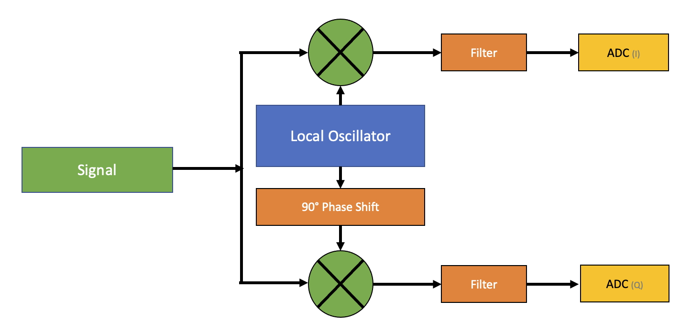

# Saving the Signal
A signal is any observable change[^cant_stop]. In the last unit we looked at *continuously* changing waves which can be, conveniently, labeled as **continuous signals** (aka., analog signals). We could try to create analog tools that help us continuously measure and modify these continuous signals (which has been, and still is, a very common approach to working with wireless waves). However, we will follow a different path for this workshop. We will measure analog signals at regular time intervals[^usrp_adc_rate] and then save each individual measurement as a set of numbers. Sampling provides us with **discrete signals** (aka., digital signals). We can work with recorded samples in many useful ways, including eventually converting the recorded samples back in to an analog wave.

There is a cost to this digital approach. Because of the intermittent sampling, we may lose some information about the continuous wave. Of course, we could always try to collect our samples at shorter and shorter intervals, but this requires more processing power and extra space to store the samples (and at some point, we start to run into the current limits of physics). In this unit, we will consider how slowly we can collect samples and still accurately represent the signal we are trying to decode.

## Nyquist-Shannon Theorem
Let's say we want to process the fewest number of samples but still want to able to accurately represent a specific signal. We could do some math and try and figure out the minimum number of samples we need to collect for every cycle. Unfortunately, it helps to use the Fourier Transform (which we only had time to skim over in the last unit). Instead, lets do an experiment. We can measure a signal of a known frequency (let's use 2 Hz) and use different sample rates to see what happens:

**Figure 2.1:** A comparison of decreasing sample rates, resulting in signal aliasing.

Things look fine at faster sample rates. However, as we slow down to only four samples per second (sps), we start to run into issues. If we start sampling when the signal is at equilibrium, the amplitude of our recovered wave drops to zero. However, if we start taking samples at other points, we can still recover our original wave. As we get below four samples per second, the recovered waveform starts changing into different frequencies (this is called aliasing).

Experimentally, to recover the original wave, it looks like we need at least two samples per wave cycle (which means four samples per second with a 2 Hz frequency). We just discovered the Shannon's Sampling Theory. In Shannon's words:

> If a function $x(t)$  contains no frequencies higher than B hertz, it is completely determined by giving its ordinates at a series of points spaced  $\frac{1}{2B}$ seconds apart.

In practice, strange things can start to happen when you get really close to twice the highest frequency you want to capture (aka., the *Nyquist rate*). Just to be safe, it is generally a good idea to capture at least 2.5 samples for every cycle you want to capture.

In wireless communications, bandwidth is defined as the difference between the highest and lowest frequency in a signal. While bandwidth, sample rate, and data rate are different, they are all closely related to one another. For now, just know that the faster you are able to sample a signal, the more bandwidth you are generally able to capture. Also, the more data you try to send using a signal, the more bandwidth that signal will need[^ook].

## Shifting the Spectrum
Based on what we have learned about sampling, for 5 GHz WiFi, we would need to capture more than ten-billion samples a second to record our signal. In the time between each sample (assuming instantaneous samples), light will only be able to travel just under three centimeters. Now, think of the sample rates needed to capture modern satellite communications at frequencies in the 40 GHz range!

Fortunately, there is a property of waves that we can use to our advantage. If we multiply (mix) two waves (e.g., $F_1$ and $F_2$, we get the sum and the differences of their frequencies $F_1 + F_2$ and $F_2 - F_1$ and $F_1 - F_2$ (don't worry about the negative frequencies for now).

**Figure 2.2:** Mixing (multiplying) a sine wave at 3kHz and 5kHz produces frequencies at 2kHz and 8kHz.

If we want to capture a signal at 5GHz, we can (after some filtering) mix our target signal with a pure sine wave created from a local oscillator (LO) at a close frequency. Let's use 4.7GHz for this example. Then (after some more filtering) the signal we want will be shifted to an intermediate frequency (IF) of 300 MHz (5 - 4.7 GHz). This process of shifting a sample is called heterodyning. This technique is what allows us to use reasonable sample rates to capture signals at high frequencies (when using an SDR, the strong sine wave you often see near your desired frequency is an artifact of this process).

Another valid question is, "Why use a 5 GHz signal in the first place?"  We *could* just transmit the signal we want to send (aka. the baseband signal) directly and not have to deal with such high frequencies.

To understand why different frequencies are used, first consider standing across the hall from a room full of people talking. Because everyone speaks at around the same frequency [^human_voice_range], everyone's voices will mix together, making the resulting signal nearly impossible to interpret. Now imagine each person decided to whistle at their own unique frequency (maybe using something like Morse code to transmit a message). As long as the frequencies were chosen carefully and the whistling was precise, you could distinguish between each message. The trick to preventing messages from getting all mixed up is to use different frequencies. By shifting our baseband signal to a different frequency, we can put multiple signals on a signal channel (aka multiplexing). If you have ever wondered how a single coax cable can hold so many different TV channels, this is how it works[^cable_filtering].

If we want to shift the human voice, we just need to make sure we leave enough room (aka. bandwidth) for each 'channel' so they do not overlap[^OFDM]. Generally, if you want to transfer more information in the same amount of time (or transfer the same amount of information faster) you need more bandwidth. More code (which can be sent using a single tone) does not need much bandwidth (100 Hz) unless is it played extremely fast. FM voice traffic only needs around (10 to 15 KHz). Transmitting FM music on the radio takes quite a bit of bandwidth (200 KHz), but not nearly as much as broadcast television (6 MHz) channel or a high-speed WiFi 6 signal (160 MHz). In unit four, we will look at how the electromagnetic spectrum is split up. For now, just  know that we can shift signals to use different frequencies. 

## Signals as Circles

In the first unit we considered various properties of a wave (e.g., amplitude, frequency, phase, polarization). In the next unit we will consider ways we can change (modulate) and interpret (demodulate) these properties to send and receive information with waves. We have just seen how to record waves as a series of samples that describe the amplitude of waves as time progresses. While we can't really get past the limits defined in the sampling theorem, there is one more 'hack' that will let us collect and use samples far more efficiently. To understand this trick, we first have to re-imagine waves as circles.

If we track a point rotating around a circle, we can make a wave on the horizontal axis.

**Figure 2.3:** Tracking points while rotating around a circle can create a wave pattern.

When we measure the amplitude of our signal, we only know how high or low the sample should be on the vertical axis. We have no good way to determine which direction the samples rotating around the circle (imagine starting on other side of the vertical axis, but then move in the opposite direction). Because of this, every measurement could be put in one of two spots on the circle.

As the signal rotates around the circle, we can also plot a wave on the horizontal axis. If we are able to instantaneously measure the amplitude of both waves, we can accurately place a sample on the circle.

**Figure 2.4:** Tracking points while rotating around a circle can create a sine wave on the vertical axis and a cosine wave on the horizontal axis.

This "signal as a circle" technique provides a lot of useful features. By looking at the radius of the circle, we can get a good idea of the amplitude. When we just recorded amplitudes over time, samples do not always land right on the peak or trough of the wave, requiring us to track and compare several samples to determine the amplitude. We can also measure the current frequency by watching how quickly samples rotate around the circle. With amplitude samples, we have to use complicated algorithms to try to determine the current frequency of the signal. Finally, by measuring the angle of a sample from a starting point, we can determine the phase of the sample relative to the start of the cycle. With amplitude samples, we would need to somehow come up with a good reference signal, align it with our measured signal, and then watch for changes in phase. So, how do we record samples on a circle?

So, how do we measure this extra signal to record our samples on a circle? This is where the 'hack' happens. Remember that we regularly need to mix an intermediate frequency with our received signal to shift the spectrum to something useful. If we shift two copies of the signal, one with a sine wave and the other with a cosine wave (note that sine and cosine are offset by 90°, just like the two signals in the circle samples above) we can then measure the amplitude of each result separately[^hardware_benefit], we can plot both the horizontal and vertical components and represent our wave as a circle. The signal that is mixed with the cosine wave before measuring is called the "In-phase" or "I" component. The out-of-phase wave (sine wave) is called the "Quadrature" or "Q" component. This is how the receiving part of a software-defined radio (SDR) works.

**Figure 2.5:** A block diagram of a basic software-defined radio receiver

To help solidify this concept, imagine creating a three-dimensional plot of the IQ values for a signal that changes amplitude, frequency, or phase over time. Note that the 'shadow' of our in-phase signal (I) shows a 2D plot of our original "amplitude only" signal.

**Figure 2.6:** Three-dimensional plots of IQ values of signals with modulated amplitude (top image) and frequency (bottom image) over time (source: [arachnoid.com](https://arachnoid.com/software_defined_radios/))

**Figure 2.7:** Plots of IQ values as a signal changes phase over time (source: [whiteboard.ping.se](http://whiteboard.ping.se/SDR/IQ))

Hopefully, now you have an good idea of why it is generally much better to save our "signal as a circle".

## Complex Numbers

Mathematicians are terrible at marketing.

For a while, people only used numbers that represented the presence things. People started to notice how useful it was to extend the number line below zero and 'make up' numbers that represent the removal of things...the mathematicians decided to call these incredible, 'new' type of numbers "negative".

Later someone (Casper Wessel) discovered that using two independent number lines positioned 90° relative to each other creates a very useful tool when working with vectors (lines with direction and magnitude).  To rotate a vector that is pointing to the right by 180°, you can just multiply it by -1. To rotate it by another 180° you can just multiple it by -1 again (e.g., $-1 \times -1 = 1$). However, to rotate by only 90°, you need a number that, when multiplied by itself twice gives you -1. The use of $i = \sqrt{-1}$ became another very useful tool. Of course, mathematicians being terrible at marketing, decided to call these numbers "complex". Even worse, they labeled the number line everyone was finally getting comfortable with as "real" and then called the new number line "imaginary".

**Figure 2.8:** Rotating vectors by multiplying by -1 and $\sqrt{-1}$ on the complex plane

In the previous section we discovered we could gain a lot of benefits from thinking about wave patterns as circles. The complex plane provides two independent, but related axis. This is convenient, because we need to plot two independent but related waves (the in-phase and quadrature waves). If we use the imaginary axis to plot the *very real* (remember, we sampled the signal using an analog-to-digital converter) quadrature (Q) signal and use the real axis to plot the in-phase signal (I), we end up with a way to plot our "wave as a circle". The use of "I" (for In-phase) on the real axis and the use of "Q" for the imaginary axis is often a source of confusion. The number $i$ is different from the real axis that is often labeled "I". To help avoid additional confusion (the symbol $i$ is also often used to designate electrical current), the symbol $j$ is often used in place of $i$ to represent $\sqrt{-1}$ in physics and engineering texts. Unless otherwise stated, we will use this convention for the remainder of this workshop.

We can use three different formats to record our sample. The first is known as the **rectangular form**:

$Z = x + j y$

In this case, $x$ is used to designate the amplitude of the in-phase signal, and the y is used to designate the amplitude of the quadrature signal.

We can use some geometry to convert the rectangular form to a polar form, which uses the radius (amplitude) and angle (phase) to record the location of our sample on the circle. This is called the **polar form**:

$Z = A(\cos(\theta)+j \sin(\theta))$ 

The polar form is often written with the shorthand $A \angle \pm \theta$

Finally, we can use a really neat trick. Euler discovered a formula (now named Euler's formula) that states:

$e^{i \theta} = \cos(\theta) + j\sin(\theta)$

This formula is pretty amazing (you should look into it more). For now, just know that we can use it to change the Polar Form into the **Exponential Form**:

$Z = A e^{j \theta}$

**Figure 2.9:** An example of different forms used to describe a point (sample) on a unit circle in the complex plane

## IQ Files

If you have played with recording signals using an SDR, you are very likely familiar with IQ files. These files are just files (usually binary) that hold a sequence of numbers to represent In-Phase and Quadrature data. That a look at the supported file types for [Inspectrum](https://github.com/miek/inspectrum) to see an example of many of the different formats used to hold IQ data.

## Additional Resources

  * Great resource on IQ files: http://whiteboard.ping.se/SDR/IQ
  * Understanding a nano-second: https://hackaday.com/2012/02/27/visualizing-a-nanosecond/
  * A good article on the Nyquist-Shannon Theorem: https://www.allaboutcircuits.com/technical-articles/nyquist-shannon-theorem-understanding-sampled-systems/
  * A look inside an RTL-SDR (note the hardware implementation of some of the techniques in this unit): https://www.youtube.com/watch?v=XdZPlmkWV3U 
  * A Quadrature Signals Tutorial: Complex, But Not Complicated: https://www.dsprelated.com/showarticle/192.php
  * Video by Andres Spiess on how SDRs work: https://www.youtube.com/watch?v=xQVm-YTKR9s
  * https://www.dsprelated.com/showarticle/192.php
  * https://jackschaedler.github.io/circles-sines-signals/
  * http://whiteboard.ping.se/SDR/IQ
  * https://arachnoid.com/software_defined_radios/

## Demos and Exercises
* **Exercise:** Play with quadrature waves in a [graphing calculator](https://www.desmos.com/calculator/0sluivhb3i)
  * How far can you adjust the phase of the resulting signal in either direction?
* **Exercise:** Play with the sample rate and signal frequency in GNU Radio.
  * Add two new "QT GUI Range" blocks. The name of the Use the name of the block as the variable for your frequecny
  * What happens in GNU radio when we change our sample rate is less than twice the frequency we want to measure?

* **Exercise:**  Use GNU Radio to look at a stream of data. How does the speed of the data change the bandwidth of the data?
* **Exercise:** Use GNU Radio to mix (multiple) two signal sources together.
  * What happens when you mix signals using the float type?
  * What happens when you mix signals using the complex type?
* **Demo:** Look at a microphone signal (converted to a complex waveform) in the constellation sink.

**Figure 2.10:** Example flow graph for GNU Radio Exercise 2.1 (sampling rate)

**Figure 2.11:** Example flow graph for GNU Radio Exercise 2.2 (data rate vs bandwidth)

**Figure 2.12:** Example flow graph for GNU Radio Exercise 2.3 (mixing signals)

[^cant_stop]: Maybe the heat death of the universe will stop signals...but until then, "You can't stop the signal".

[^usrp_adc_rate]: The USRP B205mini software-defined radio can measure around 61.44 million samples per second, or one sample every 16.3 nanoseconds (nano means one billionth). It is hard to imagine how fast 16.3 nanoseconds is....but if you do some math, you will find that light can only travel about 4.89 meters (16.0 feet) in the time it takes the receiver to collect one sample. To put this in further perspective, light only takes about 1.3 seconds to travel from the moon to the earth.

[^ook]: Consider turning a single frequency sine wave on and off to send a message (e.g., 1  = on;  0 = off). Once you try to switch the wave on and off faster than its frequency, you will cut the wave cycle short, creating a new wave pattern (at a higher frequency). With this modulation technique, you can, at best, only get a "spectral efficiency" of 1 bit per Hz (there are more efficient methods of sending a message, but at some point, the only way to reliably transfer more information is to use more frequencies (i.e., use greater bandwidth).

[^human_voice_range]: The range of the human voice is usually somewhere between 125 to 8000 Hz, but speech can be reliably transmitted by keeping 300 to 3400 Hz.

[^cable_filtering]: To block certain channels (or only provide certain services) your cable company can place filters (to block certain frequencies) on the coax cable to prevent you from receiving signals you did not pay for.

[^OFDM]: There are some techniques used to space signals that intentionally let channels overlap. One such technique is Orthogonal frequency-division multiplexing (OFDM), which is used by many digital wideband  (i.e., uses a lot of bandwidth) schemes, including 802.11a networks. However, different signals overlap in very specific ways to make recovery of each original signal possible.

[^hardware_benefit]: This double sampling is also more efficient from a hardware perspective. Instead of using one really good analog-to-digital (ADC) converter at a high sample rate, we can get similar results using two different ADCs with lower sample rates.

