# Shaping the Signal

In the first unit we looked at various properties of waves. In the last unit we looked at different ways we could record signals. In this unit, we will briefly consider different ways to change (modulate) the various properties of waves to transmit information. While most of this section will be hands on, here are some basics. 

## Amplitude Modulation

One of the simplest forms of modulation is Amplitude Modulation. By mixing a signal you want to transmit (i.e., the baseband signal) with a carrier wave (e.g., from a local oscillator), you can create a signal at a much higher frequency that still has the shape (envelope) of the baseband signal.

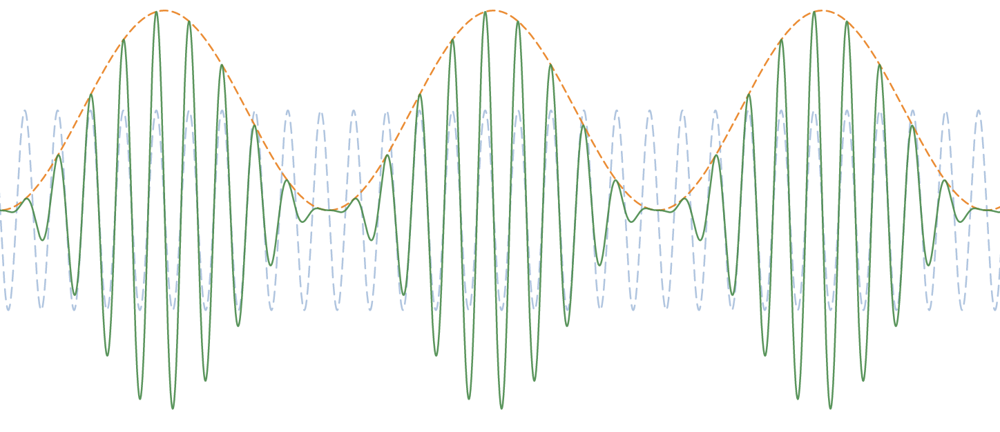

**Figure 3.1:** An Amplitude Modulated (AM) signal (green) can be created by mixing (multiplying) a carrier signal (blue) with a baseband signal (orange) added to a constant value ([playground](https://www.desmos.com/calculator/1agtclcajh)).

Remember that if we mix two waves together, the result is the sum *and* the difference of the waves. This can be seen in a waterfall diagram of an amplitude modulated signal. Low frequencies in the baseband signal stay close to the carrier wave, while high frequencies move farther away from the center. Because mixing waves creates both the sum and the difference, AM modulated signals have a symmetry around the carrier frequency.

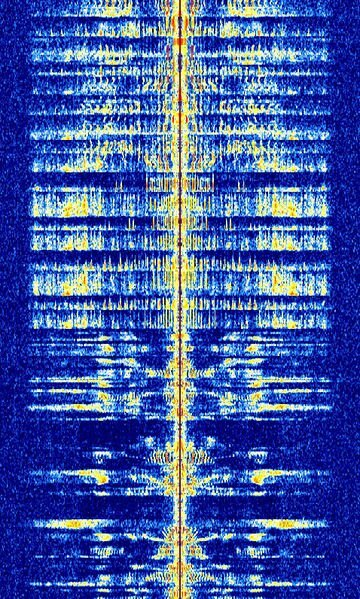

**Figure 3.2:** A waterfall diagram showing an amplitude-modulated (AM) signal of a human voice (image source: [sigidwiki](https://www.sigidwiki.com/wiki/File:AM_radio.jpg))

Of course, transmitting two copies of the signal this is not very efficient. To use less space, it is possible to suppress one side of the modulated wave form. This is called **single-sideband** (SSB) modulation. The higher-frequency side is called the upper sideband (USB) and the lower frequencies are called the lower sideband (LSB).

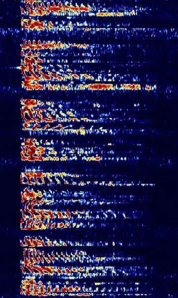

**Figure 3.3:** A waterfall diagram showing single-sideband modulation using the upper sideband (image source: [sigidwiki](https://www.sigidwiki.com/wiki/File:USB_Waterfall.png))

For digital systems, the goal is to transfer binary data (ones and zeros). One way to do this is by creating a baseband signal that uses a low (or non-existent) amplitude to represent a "zero" value and a high-amplitude signal to represent a "one" value. This is called Amplitude Shift Keying (ASK). While it is certainly possible to transmit the carrier wave the entire time you are transmitting a message using ASK, it is often better to only transmit when you want to send a "one". This type of ASK is called **on-off keying** (OOK), and is one of the most common forms of ASK.

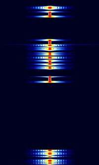

**Figure 3.4:** A waterfall diagram showing on-off keying in a teleprinter system (image source: [sigidwiki](https://www.sigidwiki.com/wiki/Hellschreiber))

## Frequency Modulation

We can also change the frequency of a signal over time to send information. In the analog world, this is often achieved with a [voltage-controlled oscillator](https://en.wikipedia.org/wiki/Voltage-controlled_oscillator) (VCO), that changes the frequency of one sample based on the amplitude of another sample.

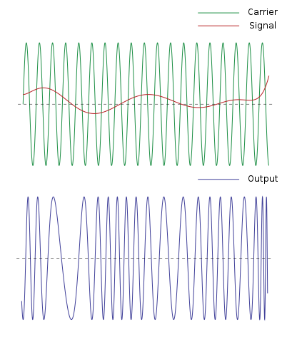

**Figure 3.4:** An example of Frequency modulation (image source: [Wikimedia](https://commons.wikimedia.org/wiki/File:FM-Final-Wiki-TEK.svg))

To send binary data, certain tones can be selected to represent ones and zeros. This is called **frequency-shift keying** (FSK). It is also possible to use multiple tones to represent more numbers (e.g., 00,01,10,11). This is called **multi-frequency shift keying** (MFSK).  two-tone warning tones that are part of emergency broadcasts:

**Figure 3.5:** A waterfall diagram showing audio frequency shift keying (AFSK) in the digital sections of  [SAME](https://www.sigidwiki.com/wiki/File:EAS_NFM.jpg) message used in the Emergency Alert System (EAS) broadcast (image source: [sigidwiki](https://www.sigidwiki.com/wiki/File:EAS_NFM.jpg))

Another example of digital messages that use different frequencies to send information is the **dual-tone multi-frequency** (DTFM) signals you hear every time you press a key on your phone.

|            | 1209 Hz | 1336 Hz | 1477 Hz | 1633 Hz |
| ---------- | ------- | ------- | ------- | ------- |
| **697 Hz** | 1       | 2       | 3       | A       |
| **770 Hz** | 4       | 5       | 6       | B       |
| **852 Hz** | 7       | 8       | 9       | C       |
| **941 Hz** | *       | 0       | #       | D       |

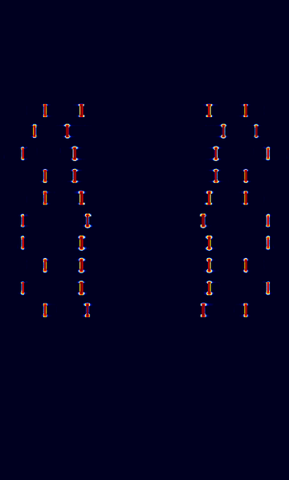

**Figure 3.6:** A waterfall diagram showing a DTFM signal (image source: [sigidwiki](https://www.sigidwiki.com/wiki/File:Motorola_rate_250ms.png))

Of course, you can also modulate a baseband audio signal using frequency modulation. This looks very similar to an AM signal, except the amplitude of the baseband translates to higher and lower frequencies in the modulated signal (unlike AM, where frequencies in the baseband translate to higher and lower frequencies in the modulated signal).

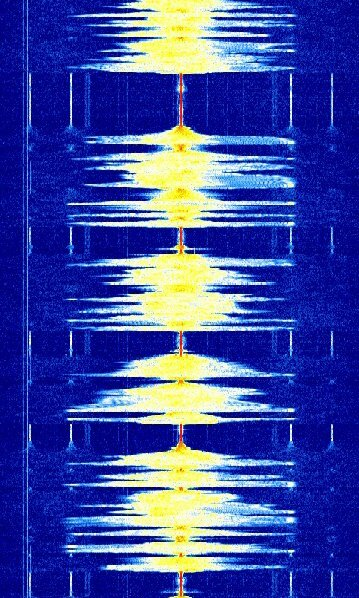

**Figure 3.7:** A waterfall diagram showing an FM Radio broadcast (image source: [sigidwiki](https://www.sigidwiki.com/wiki/File:Broadcast_FM.jpg))

The baseband of FM Radio Broadcasts is made up of many different parts, including mono and stereo audio and [Radio Broadcast Data System](https://en.wikipedia.org/wiki/Radio_Data_System) (RBDS) data (to provide information like station name and the song title):

**Figure 3.8:** A breakdown of the different parts of the baseband signal in FM Broadcast Radio (image source: [Wikipedia](https://en.wikipedia.org/wiki/FM_broadcasting#/media/File:RDS_vs_DirectBand_FM-spectrum2.svg)).

## Phase Modulation

There is one more property of waves commonly used to modulate signals: phase.  When discussing phase modulation, it is much easier to think about signals on the "signal circle" (it is so related to phase, that our "signal circle" is formally called a phasor). Remember that the angle of our sample on the circle represents its current phase. By switching the phase of our signal, we can make samples show up at different points on the phasor. The simplest form of digital phase modulation is **binary phase shift keying** (BPSK), which switches the phase of a signal by 0° to represent a one and 180° to represent a zero.

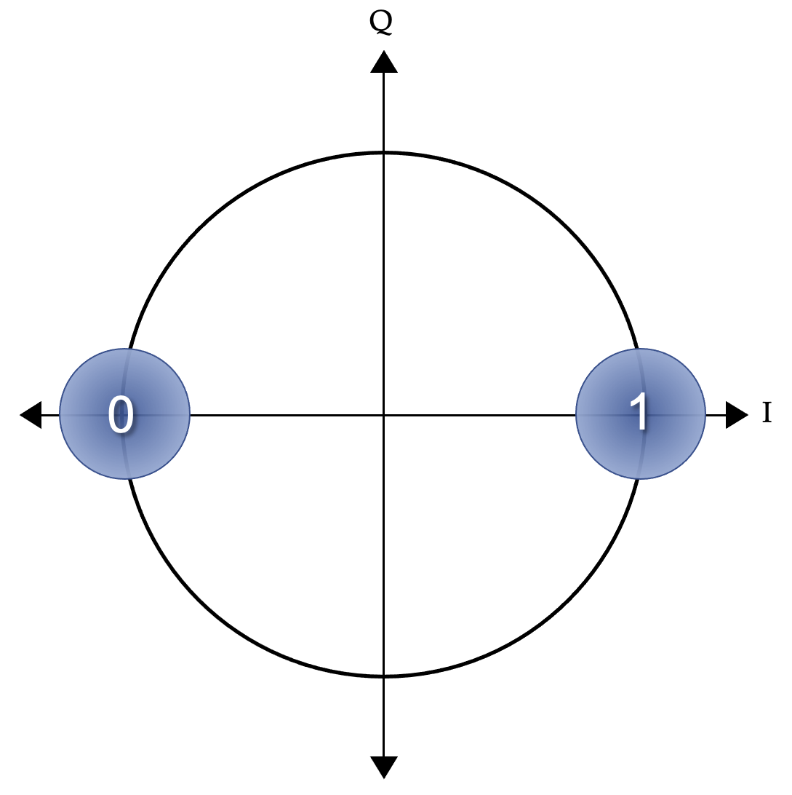

**Figure 3.9** A phasor showing the locations of a zero and one in binary-phase shift keying (BPSK) modulation

We can extend this idea and use even more phase shifts (corresponding) to represent more symbols. For example quad-phase shift keying (QPSK) uses four samples, each 90° out of phase:

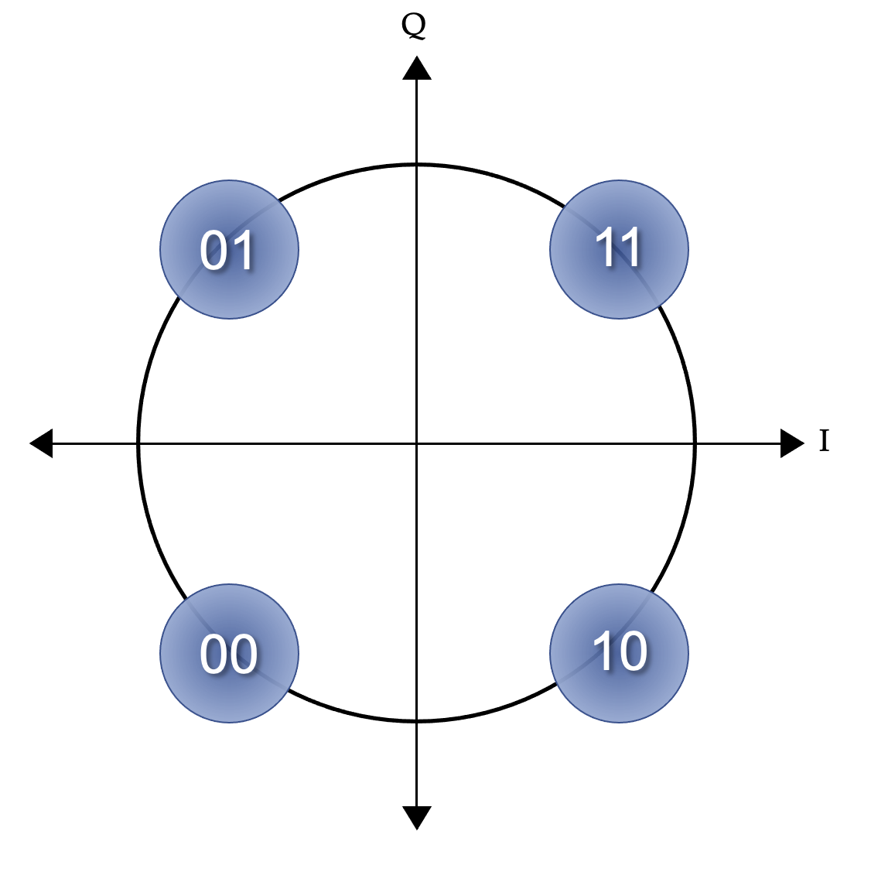

**Figure 3.10** A phasor showing the locations of values for quadrature phase-shift keying (QPSK) modulation

## Quadrature Amplitude Modulation

There is one more great thing about the "signals as circles" concept that we have not yet touched on. You can use the same idea to create a signal. By adjusting the amplitude of our in-phase signal ($I = A\cos{\theta}$) and quadrature signal ($Q = A \sin{\theta}$), we can modify the amplitude, frequency, and phase of our output signal ([playground](https://www.desmos.com/calculator/rg9ftvzgdv)).  This is how an software-defined radio (SDR) transmitter works.

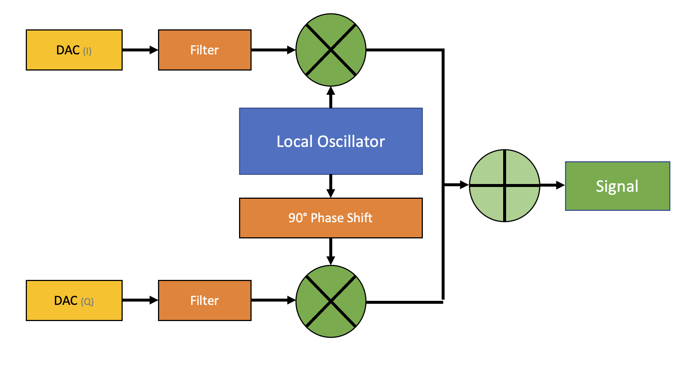

**Figure 3.11:** A block diagram of a basic software-defined radio transmitter

We can use this idea to create very complicated modulation schemes. Many of the technologies we depend on today (e.g., cell phones and wireless networks) use these advanced modulation types to send and receive data.

For example, 16-QAM uses 16 different symbols located at various locations on the phasor:

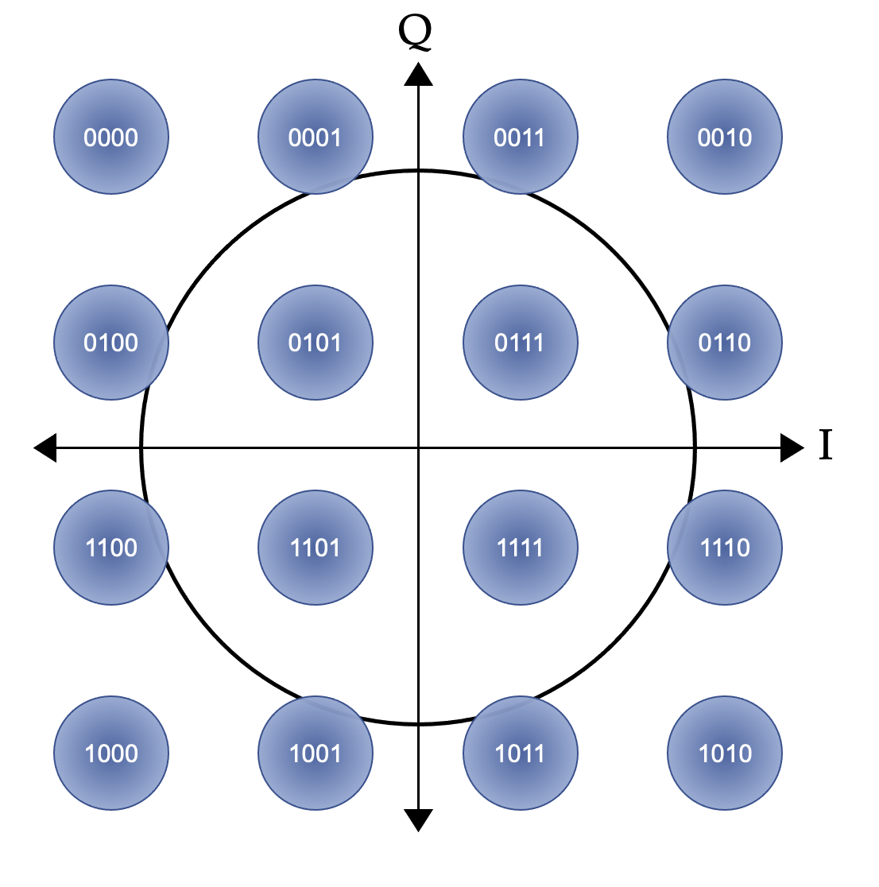

**Figure 3.12:** A phasor showing symbols for 16-QAM modulation (note that the symbol location is based on a [Gray code](https://en.wikipedia.org/wiki/Gray_code))

Some ultra-high capacity microwave systems even use up to 1024-QAM (but they require a very high signal-to-noise ratio)!

## Demos and Exercises

**Exercise:** AM Modulation in GNU Radio

* As the frequency of the baseband signal changes, what happens to the AM signal?
* As the amplitude of the baseband signal changes, what happens to the AM signal?

**Exercise:** FM Modulation in GNU Radio

* As the frequency of the baseband signal changes, what happens to the FM signal?
* As the amplitude of the baseband signal changes, what happens to the FM signal?

**Exercise:** Online signal hunting

* Review public [WebSDR](http://www.websdr.org/) signals and use (the incredibly helpful) [Signal Identification Guide](https://sigidwiki.com) to try to determine what type of modulation is being used.
* Use the [SatNogs DB](https://db.satnogs.org) to look at various satellite transmission. Compare the waterfall diagrams of the images with the operating modes.

# Additional Resources
  * Video from W2AEW explaining IQ signals and modulation: https://www.youtube.com/watch?v=h_7d-m1ehoY
  * https://www.st-andrews.ac.uk/~www_pa/Scots_Guide/RadCom/intro.html
  * Demo of AM Modulation in GNURadio by VE6EY:https://www.youtube.com/watch?v=0crC03-YoC8
  * Some math behind AM Radio: https://www.electronics-notes.com/articles/radio/modulation/amplitude-modulation-am-theory-equations-formulas.php
  * Good summary of different modulation types: https://www.elttam.com/blog/intro-sdr-and-rf-analysis/#content