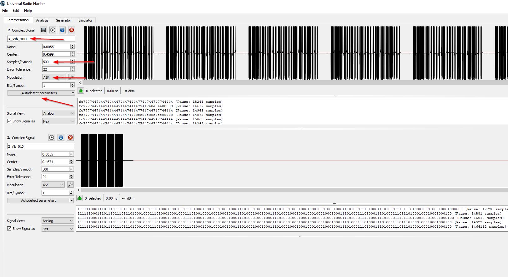

# Satellites to Shock Collars
## Software / Tools
- Universal Radio Hacker - https://github.com/jopohl/urh
- Windows Driver for SDR - https://zadig.akeo.ie/
- HackRF One - https://greatscottgadgets.com/hackrf/one/

## Shock Collars
In this first demonstration we'll be taking a look at a shock collar and attempt to see if we can decode and replay the signals from it. The image below is a picture of the device we'll be investigating. You'll notice it has a handful of different options such as:

- Shock (0-100)
- Vibrate (0-100)
- Sound (0-100)
- Light

**Figure 7.1:** Target Shock Collar

All wireless devices licenced for sale in the United States must gain FCC approval before going to market. This means manufacturers must submit designs, schematics and other useful information. This information is publicly available if you have the devices FCC ID.

If we take a close look at the back of our shock collar we can see the associated FCC ID. 

**Figure 7.2:** FCC ID listed on the back of the Shock Collar

The FCC website can be a bit of a pain to navigate. However the website https://fcc.io helps easily route you to where you want to go. Simply appending the discovered FCC ID to the websites URL will take you to the devices FCC testing information. 

**Figure 7.3:** FCC documents for the Shock Collar (Source: [apps.fcc.gov](https://apps.fcc.gov/oetcf/eas/reports/ViewExhibitReport.cfm?mode=Exhibits&RequestTimeout=500&calledFromFrame=Y&application_id=l2mvTCU%2BJNdGAvMsfARqpg%3D%3D&fcc_id=YIC201507-998DB))

Inspecting the documents available we can find a wealth of information, schematics and photos of our target device. Below we can see the conveniently provided modulation and frequency of the device.

**Figure 7.4:** Information about the device modulation and frequency (source: [FCC test report](https://apps.fcc.gov/eas/GetApplicationAttachment.html?id=2759146))

Armed with this information, we have a great starting point to record some sample signals with the previously mentioned tool univeral radio hacker, and a HackRF One. It should be noted that there are a wide variety of software defined radios (SDRs) which can accomplish this task. However, the HackRF is among the best supported and well documented.

**Figure 7.5:** Create a new recording a signal using Universal Radio Hacker

Next we'll verify we have the correct frequency and device selected. Note that each HackRF or SDR will have a unique ID that will show up within the dropdown menu. When you're ready to record a signal simply press the 'Start' button to begin recording. You can repeat this process continually to collect a variety of samples from the transmitter. One thing you may notice is that each trigger of the transmitter will produce a repeating pattern. You'll only need to analyze a single pattern, but it is useful to compare the patterns to one another to catch any errors or noise.

**Figure 7.6:** Starting a recording in Universal Radio Hacker using HackRF

Once you've saved a sample you'll be able to analyze it within universal radio hacker. This tool operates much like an audio editing program where you can zoom in and out of the captured signals. You can also trim, cut and splice the captured signals in order to make them easier to analyze. There's also a built in function which allows you autodetect modulation and samples. Keep in mind you might have to fine tune these numbers yourself.

**Figure 7.7:** Captured signal from the shock collar

Take some time to get acquainted with the software and notice that you can select specific bits which will highlight the relevant parts of the signal. You can use this to step through your signal and verify the timing.

**Figure 7.8:** Reviewing individual bits and adjusting samples per symbol in Universal Radio Hacker

Once you've isolated your signals and cleaned up any errors, you can begin to compare various signals side by side under the 'Analysis' tab. In this section of the program you can compare parts of the signals that differ from one another. This is extremely useful when comparing the different variables from different options from the transmitter. As you can see in the image below we're comparing four different recordings where we've only varied the intensity of the vibration function on the transmitter. Does anything stand out to you here? Spend some time acquainting yourself with the different features available on this tab.

**Figure 7.9:** Looking for differences in the various messages

Next you can simply replay any of your previously captured signals. The benefit here is that you don't need to understand what each aspect of the transmitted code does if you only want to replay the signal you've captured. However, once you understand how flipping bits in the transmitted code affects the collar you can begin to craft your own custom commands. You'll notice this device uses the same code continually for each press of the transmitter which makes it vulnerable to a replay attack.

**Figure 7.10:** Replaying a captured signal using Universal Radio Hacker 

Can you think of any ways to improve the security of this device? Why might the engineers have settled for such a simple design?

## NOAA Satellites
### Background on NOAA Satellites

NOAA (National Oceanic and Atmospheric Administration) operates a variety of satellites which transmit images of Earth constantly. It is possible with some inexpensive hardware, or just purely software and an internet connection to record these signals as a satellite passes overhead and use them to generate images of what the satellite sees below. We'll be focusing on the 4 polar-orbiting satellites (NOAA-15, NOAA-18, and NOAA-19). 
- **How do the satellites relay date back to Earth?** 
Polar orbiting NOAA satellites typically transmit data on the VHF (2M) band with circular polarization. This type of polarization requires a specific configuration/set of antennas. Luckily they are easy to build, or you may not even need an antenna at all. (Which we will discuss later)
### Where can you find a viable pass?

The website https://www.heavens-above.com/ maintains a database of a variety of satellites and their current orbits. It's possible to plug in your approximate location in order to get an idea of when the satellite might next be overhead. Take a look at the "Amateur Satellites" link.

**Figure 7.11:** Example of NOAA-18 pass information from heaves-above

**Figure 7.12:** List of upcoming satellite passes using heavens-above

**Figure 7.13:** NOAA 18 Satellite Information from heavens-above

### Where to listen online

If you don't have the ability, space or time to build or buy your own antenna it's possible to listen live to user provided stations all across the globe. Check out: http://www.websdr.org/ to find stations that are online and capable of recieving signals.

**Figure 7.14:** Viewing radio signals using a WebSDR (erc-websdr.esa.int)

**Figure 7.15:** Resampling a captured NOAA signal to 11025 samples/s using Audacity

### Decode satellite telemetry from recording 

In order to convert your recorded audio to a beautiful image, you'll need the following software:
- https://wxtoimgrestored.xyz/downloads/ 
Be sure to download the 'beta' version if you're using a modern opearting system. The software is pretty old and maintained by some awesome individuals. 

**Figure 7.16:** Opening the audio recording of the NOAA signal in WXtoImg

**Figure 7.17:** Updating Kepler data in WXtoImg

**Figure 7.18:** Using WXtoImg to apply the MSA multispectral analysis image enhancement

**Figure 7.19:** Using WXtoImg to apply the Resync and Despeckle options

**Figure 7.20:** An example of the final image captured from a NOAA satellite

